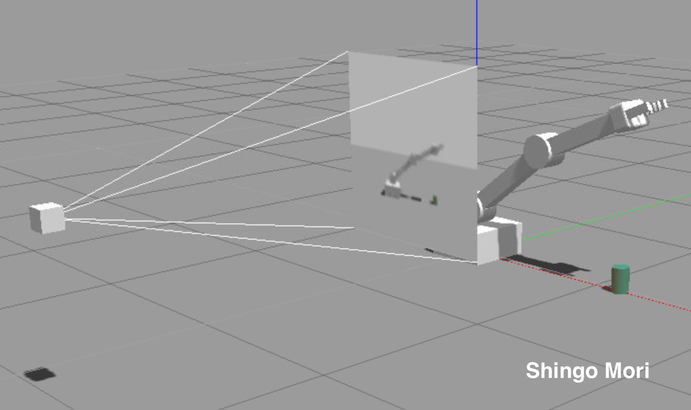

# RoboND-WhereAmI-Project

The fourth project of the Udacity Robotics Software Nanodegree Program Term 2.

In this project, I built a robotic arm agent that uitlizes [Deep Q-Network](https://deepmind.com/research/dqn/) to touch the object of interest. Mainly, I defined a reward function and tuned hyperparameters to carry out the following two primary objectives:

1. Have any part of the robot arm touch the object with at least a 90% accuracy for a minimum of 100 runs.
2. Have only the gripper base of the robot arm touch the object with at least a 90% accuracy for a minimum of 100 runs.

For more details, a writeup is available [here](https://github.com/shingo-uzuki/RoboND-DeepRL-Project/blob/master/submission/RoboND-DeepRL-writeup.pdf).

